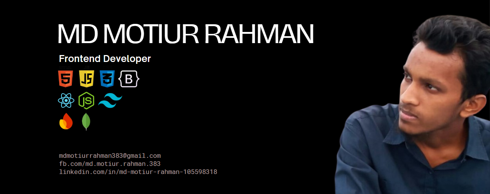

  

###

<h1 align="center">Hello There.. 👋 I am Motiur Rahman!</h1>

###

<h4 align="center">(Frontend Developer)</h4>

###

<h2 align="center">👨‍💻 About me</h2>

###

I am a Junior Front-End Developer with a strong passion for creating user-friendly and interactive web applications. As a MERN stack enthusiast, I enjoy exploring new technologies and continuously improving my skills. Beyond coding, I have a deep appreciation for nature and actively engage in social work.  Let's connect and collaborate! 🚀

###

<h2 align="center">🔧 Current Activities</h2>

###

⚡ Developing modern web applications using React & Tailwind CSS ⚡ Enhancing UI/UX with responsive and interactive designs ⚡ Managing state efficiently with Context API ⚡ Implementing React Router for seamless navigation ⚡ Building wishlist and cart functionalities for e-commerce platforms ⚡ Creating dynamic image sliders for engaging user experiences ⚡ Integrating map features for location-based services ⚡ Implementing Firebase Authentication for secure login systems ⚡ Optimizing performance and accessibility in web applications ⚡ Ensuring mobile responsiveness across all devices ⚡ Exploring advanced React features for better scalability ⚡ Writing clean, maintainable, and scalable code ⚡ Staying updated on modern front-end development trends

###

<h2 align="center">🎯 Skills</h2>

###

<h5 align="left">Frontend Development:</h5>

###

  
  
  
  
  
  
  
  
  
  
  
  
  

###

<h5 align="left">Frontend Development:</h5>

###

  
  
  
  
  

###

<h5 align="left">Tools & Technologies:</h5>

###

  
  
  
  
  
  
  

###

<h2 align="center">🔗 Social Links</h2>

###

  
  
  
  
  

###

<h2 align="center">📈 Relevant GitHub Stats</h2>

###

  
  

###

  

###